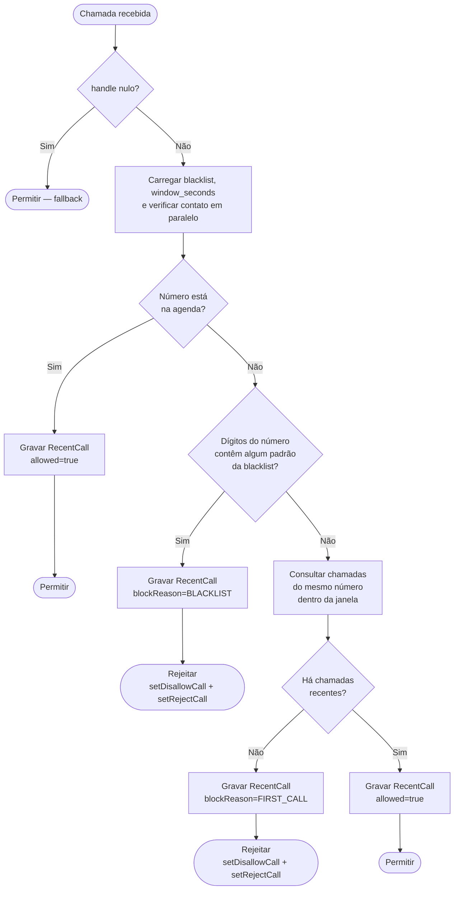
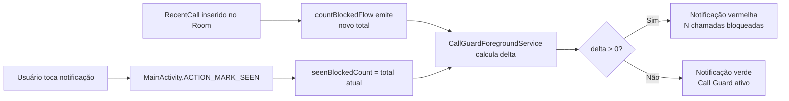

# Call Guard — Arquitetura

Aplicativo Android de triagem de chamadas. Bloqueia automaticamente chamadas de números desconhecidos e permite configurar uma lista negra baseada em sequências numéricas.

**Regra principal:** chamadas de números na agenda são sempre permitidas. Para os demais, a chamada é permitida somente se o número já tiver ligado anteriormente dentro da janela de tempo configurada. Chamadas de números na lista negra são sempre bloqueadas.

---

## Estrutura do projeto

Projeto Android de módulo único (`app`), compilado com SDK 36, mínimo SDK 29 (Android 10).

```
call-guard/
├── app/src/main/
│   ├── AndroidManifest.xml
│   └── java/com/acdcmaia/callguard/
│       ├── CallGuardApp.kt          # Application — inicializa repositórios
│       ├── MainActivity.kt          # Entrada + gestão do role de triagem + reset do contador de notificação
│       ├── data/
│       │   ├── db/                  # Room: entidades, DAOs, base de dados
│       │   ├── CallRepository.kt    # Blacklist + chamadas recentes
│       │   ├── CallLogRepository.kt # Histórico mesclado (Room + sistema), filtra efetuadas, resolve nomes
│       │   ├── SettingsRepository.kt# Preferências (DataStore): janela de tempo + contador de bloqueadas vistas
│       │   ├── ContactsRepository.kt# Verificação e resolução de nomes da agenda
│       │   └── CallHistoryItem.kt   # Modelo de exibição do histórico
│       ├── service/
│       │   ├── CallGuardScreeningService.kt  # Triagem de chamadas
│       │   ├── CallGuardForegroundService.kt # Notificação persistente dinâmica
│       │   └── PhoneStateReceiver.kt         # Diagnóstico de estado de chamada
│       └── ui/
│           ├── Navigation.kt        # Bottom navigation (3 abas)
│           ├── calls/               # Histórico de chamadas
│           ├── blacklist/           # Lista negra
│           └── settings/            # Configurações
```

---

## Componentes principais

### `CallGuardApp`
Classe `Application`. Inicializa e expõe como singletons:
- `AppDatabase` (Room)
- `CallRepository`
- `CallLogRepository`
- `SettingsRepository`
- `ContactsRepository`

### `MainActivity`
- Verifica se o app possui o `ROLE_CALL_SCREENING` do Android
- Se não tiver, exibe tela pedindo permissão via `RoleManager`
- Se tiver, inicia o `CallGuardForegroundService`
- Ao receber o intent `ACTION_MARK_SEEN` (disparado pelo toque na notificação), consulta o total atual de chamadas bloqueadas no Room e salva em `SettingsRepository.seenBlockedCount`, zerando o contador da notificação
- Usa `launchMode="singleTop"` para receber `ACTION_MARK_SEEN` via `onNewIntent()` quando o app já está em primeiro plano

### `CallGuardScreeningService`
Implementa `CallScreeningService` do Android. É vinculado pelo framework telecom a cada chamada recebida.

- Executa a lógica de triagem em `Dispatchers.IO` com `coroutineScope { async }` para carregar blacklist, configurações e verificação de contato em paralelo
- Se o número estiver na agenda, permite imediatamente (espelhando o comportamento das OEMs)
- Sempre chama `respondToCall()`, inclusive em caso de exceção (fallback: permitir)
- Usa `setDisallowCall(true)` + `setRejectCall(true)` para bloquear: o chamador recebe sinal de ocupado imediatamente

### `ContactsRepository`
Consulta `ContactsContract.CommonDataKinds.Phone` para verificar se um número pertence à agenda e obter o nome do contato. O cache é um `Map<String, String>` (dígitos → nome de exibição), invalidado via `ContentObserver` quando os contatos do dispositivo mudam. A comparação usa os últimos 8 dígitos para tolerar diferenças de código de país e formatação.

Métodos públicos:
- `isContact(number)` — verifica se o número está na agenda
- `getContactName(number)` — retorna o nome do contato, ou `null` se não encontrado

### `CallGuardForegroundService`
Serviço de notificação persistente (`foregroundServiceType="dataSync"`). Mantém o processo do app vivo para garantir que o `CallGuardScreeningService` seja vinculado pelo telecom sem ser morto pelo sistema.

Observa em tempo real a combinação de dois flows:
1. `RecentCallDao.countBlockedFlow()` — total acumulado de chamadas bloqueadas no Room
2. `SettingsRepository.seenBlockedCount` — total visto na última vez que a notificação foi tocada

O delta entre os dois valores determina o estado da notificação:
- **Delta = 0:** fundo verde, ícone de escudo simples, texto "Call Guard ativo"
- **Delta > 0:** fundo vermelho, ícone de escudo com !, texto "N chamada(s) bloqueada(s)"

A notificação atualiza automaticamente a cada nova chamada bloqueada, sem necessidade de reiniciar o app.

### `PhoneStateReceiver`
Receiver de `android.intent.action.PHONE_STATE`. Adicionado como ferramenta de diagnóstico para confirmar se chamadas chegam ao processo do app, independentemente do `CallScreeningService`.

---

## Camada de dados

### Room — `callguard.db`

| Tabela | Entidade | Descrição |
|---|---|---|
| `blacklist_patterns` | `BlacklistPattern` | Sequências de dígitos a bloquear |
| `recent_calls` | `RecentCall` | Registro de cada chamada processada pelo app |

**`BlacklistPattern`**
```
id (PK, autoincrement)
pattern: String   — sequência de dígitos (ex: "98181")
label: String     — descrição opcional
```

**`RecentCall`**
```
id (PK, autoincrement)
number: String
timestamp: Long
allowed: Boolean
blockReason: BlockReason?  — BLACKLIST | FIRST_CALL | null (se permitida)
```

### DataStore — `settings`

| Chave | Tipo | Default | Descrição |
|---|---|---|---|
| `window_seconds` | Int | 120 | Janela de tempo em segundos |
| `seen_blocked_count` | Long | -1 | Total de bloqueadas na última vez que a notificação foi tocada; -1 = primeiro uso |

### `CallLogRepository`
Agrega duas fontes para o histórico:
1. **Log do sistema** (`CallLog.Calls`) — chamadas registradas pelo Android, excluindo as efetuadas (`OUTGOING_TYPE`)
2. **Room** (`recent_calls`) — chamadas processadas pelo app

Para cada entrada, resolve o nome do contato via `ContactsRepository.getContactName()`. Entradas do Room sem correspondência no log do sistema (chamadas bloqueadas ainda não registradas pelo Android) aparecem imediatamente como `appOnly = true`, garantindo atualização em tempo real.

### `CallHistoryItem`
Modelo de exibição do histórico. Campos relevantes:

| Campo | Tipo | Descrição |
|---|---|---|
| `number` | String | Número do chamador |
| `contactName` | String? | Nome do contato na agenda, ou null |
| `timestamp` | Long | Momento da chamada |
| `callType` | Int | Tipo conforme `CallLog.Calls` (-1 para `appOnly`) |
| `blockReason` | BlockReason? | Motivo do bloqueio, ou null se permitida |
| `appOnly` | Boolean | True para bloqueadas ainda não no log do sistema |

---

## Fluxo de triagem de chamada



---

## Fluxo de atualização do histórico


---

## Fluxo da notificação dinâmica



---

## Lógica de correspondência da lista negra

A correspondência **não usa regex**. É uma busca de substring sobre os dígitos do número:

```
número chamador : "+5521XXXXXXXX"
dígitos extraídos: "5521XXXXXXXX"
padrão na blacklist: "98181"
resultado: BLOQUEADO  ✓  ("5521XXXXXXXX".contains("98181"))
```

Wildcards não são suportados. O campo da lista negra aceita apenas dígitos.

---

## Navegação

Bottom navigation com 3 abas:

| Rota | Tela | Descrição |
|---|---|---|
| `calls` | `RecentCallsScreen` | Histórico de chamadas recebidas e bloqueadas (chamadas efetuadas não são exibidas); nome do contato exibido quando disponível; bloqueadas em vermelho |
| `blacklist` | `BlacklistScreen` | Gerenciar sequências bloqueadas; suporta adicionar, editar e remover |
| `settings` | `SettingsScreen` | Janela de tempo em segundos; build info no ícone ⓘ |

---

## Permissões e role

| Permissão | Motivo |
|---|---|
| `ROLE_CALL_SCREENING` | Obrigatório para o `CallScreeningService` ser vinculado pelo telecom |
| `READ_PHONE_STATE` | Receber broadcast de estado de chamada (`PhoneStateReceiver`) |
| `READ_CONTACTS` | Verificar se o número chamador está na agenda e resolver nomes |
| `READ_CALL_LOG` | Ler o log de chamadas do sistema para o histórico |
| `FOREGROUND_SERVICE` / `FOREGROUND_SERVICE_DATA_SYNC` | Manter o serviço persistente ativo |
| `POST_NOTIFICATIONS` | Notificação do `CallGuardForegroundService` |

O role é solicitado via `RoleManager.createRequestRoleIntent`. Cada reinstalação revoga o role e gera novo UID, apagando a base de dados Room.

---

## Decisões de arquitetura

**`coroutineScope { async }` no serviço de triagem**
Blacklist, configurações e verificação de contato são carregadas em paralelo dentro de `coroutineScope`. Usar `CoroutineScope(Dispatchers.IO).async` criaria scopes não gerenciados; `coroutineScope` garante concorrência estruturada e propagação de exceções.

**Verificação de contatos no próprio app**
Mesmo em OEMs que já fazem bypass automático (MIUI, Samsung), a verificação de contatos é feita pelo próprio app. Isso garante comportamento consistente em dispositivos onde o `onScreenCall` é invocado para contatos, e espelha a decisão que as OEMs tomariam.

**Fallback always-allow**
Qualquer exceção não tratada durante a triagem resulta em `respondToCall` com resposta padrão (permitir). O Android impõe um timeout; não chamar `respondToCall` também deixaria a chamada passar, mas geraria ANR no serviço.

**`setDisallowCall + setRejectCall`**
Bloquear apenas com `setDisallowCall` silencia a chamada do lado do destinatário mas o chamador continua a ouvir toque. Adicionar `setRejectCall` envia sinal de ocupado imediatamente, encerrando a chamada no lado do chamador também.

**Histórico com dupla fonte**
O log do sistema só registra chamadas após o fim da ligação. Para mostrar chamadas bloqueadas imediatamente, o `CallLogRepository` inclui registros do Room sem correspondência no log do sistema (`appOnly = true`). Quando o log do sistema eventualmente registra a entrada, ela substitui a entrada `appOnly` no próximo refresh.

**Contador de notificação por delta de contagem**
O estado da notificação é determinado pela diferença entre o total acumulado de chamadas bloqueadas no Room e o valor `seenBlockedCount` salvo no DataStore. Isso evita consultas por intervalo de tempo e é naturalmente consistente após reinicializações do serviço. O valor `-1` em `seenBlockedCount` indica primeiro uso e é tratado como delta zero, evitando que chamadas históricas apareçam como "novas" na primeira execução.

**`launchMode="singleTop"` na MainActivity**
Usado para receber `ACTION_MARK_SEEN` via `onNewIntent()` quando o app já está em primeiro plano, sem criar instâncias duplicadas.

**Tooltips com posicionamento abaixo do campo**
O Material3 `TooltipDefaults` não expõe controle de posição vertical. É usado um `PopupPositionProvider` customizado que posiciona o balão em `anchorBounds.bottom`, garantindo que não ultrapassa a largura da janela. Aplicado nos campos "Segundos" (Configurações) e "Sequência de dígitos" (Lista Negra).

---

## Comportamento em OEMs — MIUI e Samsung

Em dispositivos Xiaomi (MIUI) e Samsung, o framework telecom **ignora o `CallScreeningService` para números salvos nos contatos**, aprovando-os automaticamente sem invocar `onScreenCall`.

**Confirmação:** testado adicionando e removendo o mesmo número da agenda. Com o número na agenda, `onScreenCall` nunca é invocado (logcat do `system_server` mostra `[Allow, contact exists]`, zero logs `CallGuard`). Com o número removido da agenda, o serviço de triagem é invocado normalmente e o bloqueio funciona.

**Comportamento do app:** o `CallGuardScreeningService` também verifica a agenda via `ContactsRepository` como primeira etapa da triagem. Em OEMs onde o bypass não existe, o app garante o mesmo comportamento: contatos são sempre permitidos. Em OEMs onde o bypass já existe (MIUI, Samsung), a verificação interna é redundante mas inofensiva.

**Ícone na barra de status:** confirmado no MIUI que o `setSmallIcon()` é respeitado — o ícone muda de forma conforme o estado (escudo simples = ativo, escudo com ! = bloqueadas pendentes).

**Implicação prática:** chamadas de contatos salvos na agenda nunca são bloqueadas, em qualquer dispositivo. A blacklist e a janela de tempo se aplicam apenas a números desconhecidos.

**Restrição de bateria no MIUI:** pode impedir o binding do serviço para números desconhecidos — definir o app como "Sem restrições" em Configurações → Aplicativos → Call Guard → Bateria.
