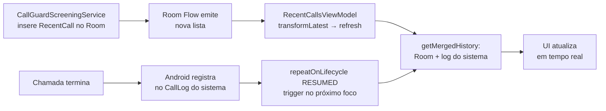
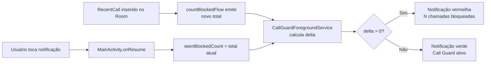

# Call Guard — Arquitetura

Aplicativo Android de triagem de chamadas. Bloqueia automaticamente chamadas de números desconhecidos e permite configurar uma lista negra baseada em sequências numéricas.

**Regra principal:** chamadas de números na agenda são sempre permitidas. Para os demais, a chamada é permitida somente se o número já tiver ligado anteriormente dentro da janela de tempo configurada. Chamadas de números na lista negra são sempre bloqueadas.

---

## Estrutura do projeto

Projeto Android de módulo único (`app`), compilado com SDK 36, mínimo SDK 29 (Android 10).

```
call-guard/
├── app/src/main/
│   ├── AndroidManifest.xml
│   └── java/com/acdcmaia/callguard/
│       ├── CallGuardApp.kt          # Application — inicializa repositórios
│       ├── MainActivity.kt          # Entrada + gestão do role de triagem
│       ├── data/
│       │   ├── db/                  # Room: entidades, DAOs, base de dados
│       │   ├── CallRepository.kt    # Blacklist + chamadas recentes
│       │   ├── CallLogRepository.kt # Histórico mesclado (Room + sistema), filtra efetuadas, resolve nomes
│       │   ├── SettingsRepository.kt# Preferências (DataStore): janela de tempo + contador de bloqueadas vistas
│       │   ├── ContactsRepository.kt# Verificação e resolução de nomes da agenda
│       │   └── CallHistoryItem.kt   # Modelo de exibição do histórico
│       ├── service/
│       │   ├── CallGuardScreeningService.kt  # Triagem de chamadas
│       │   ├── CallGuardForegroundService.kt # Notificação persistente dinâmica
│       │   └── MarkSeenReceiver.kt           # Receptor de broadcast para marcar notificação como vista
│       └── ui/
│           ├── Navigation.kt        # Bottom navigation (3 abas)
│           ├── calls/               # Histórico de chamadas
│           ├── blacklist/           # Lista negra
│           └── settings/            # Configurações
```

---

## Componentes principais

### `CallGuardApp`
Classe `Application`. Inicializa e expõe como singletons:
- `AppDatabase` (Room)
- `CallRepository`
- `CallLogRepository`
- `SettingsRepository`
- `ContactsRepository`

### `MainActivity`
- Verifica se o app possui o `ROLE_CALL_SCREENING` do Android
- Se não tiver, exibe tela pedindo permissão via `RoleManager`
- Se tiver, inicia o `CallGuardForegroundService`
- Em `onResume()`, zera o contador da notificação: lê o total atual de bloqueadas e salva em `seenBlockedCount`, fazendo o delta voltar a zero e a notificação ficar verde

### `CallGuardScreeningService`
Implementa `CallScreeningService` do Android. É vinculado pelo framework telecom a cada chamada recebida.

- Executa a lógica de triagem em `Dispatchers.IO` com `coroutineScope { async }` para carregar blacklist, configurações e verificação de contato em paralelo
- Se o número estiver na agenda, permite imediatamente (espelhando o comportamento das OEMs)
- Sempre chama `respondToCall()`, inclusive em caso de exceção (fallback: permitir)
- Usa `setDisallowCall(true)` + `setRejectCall(true)` para bloquear: o chamador recebe sinal de ocupado imediatamente

### `ContactsRepository`
Consulta `ContactsContract.CommonDataKinds.Phone` para verificar se um número pertence à agenda e obter o nome do contato. O cache é um `Map<String, String>` (dígitos → nome de exibição), invalidado via `ContentObserver` quando os contatos do dispositivo mudam. A comparação usa os últimos 8 dígitos para tolerar diferenças de código de país e formatação. O `ContentObserver` não é desregistrado intencionalmente — `ContactsRepository` é singleton de processo em `CallGuardApp`.

O `ContentObserver` e as queries ao `ContentResolver` são guardados por verificação de `READ_CONTACTS` — se a permissão não foi concedida ainda, o `init` não registra o observer e `loadCache()` retorna mapa vazio. Após o usuário conceder a permissão, `RecentCallsScreen` chama `registerPermission()` para ativar o observer retroativamente.

Métodos públicos:
- `isContact(number)` — verifica se o número está na agenda
- `getContactName(number)` — retorna o nome do contato, ou `null` se não encontrado
- `registerPermission()` — registra o `ContentObserver` após permissão concedida em runtime

### `CallGuardForegroundService`
Serviço de notificação persistente (`foregroundServiceType="specialUse"`, subtipo `callScreening`). Mantém o processo do app vivo para garantir que o `CallGuardScreeningService` seja vinculado pelo telecom sem ser morto pelo sistema.

Observa em tempo real a combinação de dois flows:
1. `CallRepository.countBlockedFlow()` — total acumulado de chamadas bloqueadas no Room (últimas 100)
2. `SettingsRepository.seenBlockedCount` — total visto na última vez que o app foi aberto

O delta entre os dois valores determina o estado da notificação:
- **Delta = 0:** fundo verde, ícone de escudo simples, texto "Call Guard ativo"
- **Delta > 0:** fundo vermelho, ícone de escudo com !, texto "N chamada(s) bloqueada(s)"

O `PendingIntent` da notificação aponta para `MainActivity` via `PendingIntent.getActivity()`. Dois canais distintos controlam o badge do ícone do app:
- `callguard_blocked` (`setShowBadge(true)`) — usado quando há bloqueios não vistos
- `callguard_idle` (`setShowBadge(false)`) — usado no estado normal; suprime o badge mesmo com notificação ongoing

Ao iniciar (via `onStartCommand`), executa uma única vez a poda de chamadas com mais de 30 dias e ajusta o `seenBlockedCount` para que não ultrapasse o novo total pós-poda.

### `MarkSeenReceiver`
`BroadcastReceiver` com `android:exported="false"`. Mantido no manifesto mas atualmente sem uso ativo — a lógica de reset do contador foi movida para `MainActivity.onResume()` (ver abaixo).

---

## Camada de dados

### Room — `callguard.db`

| Tabela | Entidade | Descrição |
|---|---|---|
| `blacklist_patterns` | `BlacklistPattern` | Sequências de dígitos a bloquear |
| `recent_calls` | `RecentCall` | Registro de cada chamada processada pelo app |

**`BlacklistPattern`**
```
id (PK, autoincrement)
pattern: String   — sequência de dígitos (ex: "98181")
label: String     — descrição opcional
```

**`RecentCall`**
```
id (PK, autoincrement)
number: String
timestamp: Long
allowed: Boolean
blockReason: BlockReason?  — BLACKLIST | FIRST_CALL | null (se permitida)
```

### DataStore — `settings`

| Chave | Tipo | Default | Descrição |
|---|---|---|---|
| `window_seconds` | Int | 120 | Janela de tempo em segundos |
| `seen_blocked_count` | Long | -1 | Total de bloqueadas na última vez que o app foi aberto; -1 (nunca aberto) é tratado como 0 no cálculo do delta |

### `CallLogRepository`
Agrega duas fontes para o histórico:
1. **Log do sistema** (`CallLog.Calls`) — chamadas registradas pelo Android, excluindo efetuadas (`OUTGOING_TYPE`) diretamente no `selection` do `ContentResolver.query()`; `LIMIT` aplicado via contador no cursor (não no sortOrder, pois MIUI rejeita SQL não padrão nesse parâmetro)
2. **Room** (`recent_calls`) — chamadas processadas pelo app

Para cada entrada, resolve o nome do contato via `ContactsRepository.getContactName()`. Entradas do Room sem correspondência no log do sistema (chamadas bloqueadas ainda não registradas pelo Android) aparecem imediatamente como `appOnly = true`, garantindo atualização em tempo real.

### `CallHistoryItem`
Modelo de exibição do histórico. Campos relevantes:

| Campo | Tipo | Descrição |
|---|---|---|
| `number` | String | Número do chamador |
| `contactName` | String? | Nome do contato na agenda, ou null |
| `timestamp` | Long | Momento da chamada |
| `callType` | Int | Tipo conforme `CallLog.Calls` (-1 para `appOnly`) |
| `blockReason` | BlockReason? | Motivo do bloqueio, ou null se permitida |
| `appOnly` | Boolean | True para bloqueadas ainda não no log do sistema |

---

## Fluxo de triagem de chamada


---

## Fluxo de atualização do histórico



---

## Fluxo da notificação dinâmica



---

## Lógica de correspondência da lista negra

A correspondência **não usa regex**. É uma busca de substring sobre os dígitos do número:

```
número chamador : "+5521XXXXXXXX"
dígitos extraídos: "5521XXXXXXXX"
padrão na blacklist: "98181"
resultado: BLOQUEADO  ✓  ("5521XXXXXXXX".contains("98181"))
```

Wildcards não são suportados. O campo da lista negra aceita apenas dígitos.

---

## Navegação

Bottom navigation com 3 abas:

| Rota | Tela | Descrição |
|---|---|---|
| `calls` | `RecentCallsScreen` | Histórico de chamadas liberadas e bloqueadas (efetuadas não exibidas); nome do contato exibido quando disponível; bloqueadas em vermelho |
| `blacklist` | `BlacklistScreen` | Gerenciar sequências bloqueadas; suporta adicionar, editar e remover |
| `settings` | `SettingsScreen` | Janela de tempo: exibe valor atual; toque abre dialog com campo e botões Cancelar/Salvar; build info no ícone ⓘ |

---

## Permissões e role

| Permissão | Motivo |
|---|---|
| `ROLE_CALL_SCREENING` | Obrigatório para o `CallScreeningService` ser vinculado pelo telecom |
| `READ_CONTACTS` | Verificar se o número chamador está na agenda e resolver nomes |
| `READ_CALL_LOG` | Ler o log de chamadas do sistema para o histórico |
| `FOREGROUND_SERVICE` / `FOREGROUND_SERVICE_SPECIAL_USE` | Manter o serviço persistente ativo (tipo `specialUse`, subtipo `callScreening`) |
| `POST_NOTIFICATIONS` | Notificação do `CallGuardForegroundService` |

O role é solicitado via `RoleManager.createRequestRoleIntent`. Cada reinstalação revoga o role e gera novo UID, apagando a base de dados Room.

---

## Decisões de arquitetura

**`coroutineScope { async }` no serviço de triagem**
Blacklist, configurações e verificação de contato são carregadas em paralelo dentro de `coroutineScope`. Usar `CoroutineScope(Dispatchers.IO).async` criaria scopes não gerenciados; `coroutineScope` garante concorrência estruturada e propagação de exceções.

**Verificação de contatos no próprio app**
Mesmo em OEMs que já fazem bypass automático (MIUI, Samsung), a verificação de contatos é feita pelo próprio app. Isso garante comportamento consistente em dispositivos onde o `onScreenCall` é invocado para contatos, e espelha a decisão que as OEMs tomariam.

**Fallback always-allow**
Qualquer exceção não tratada durante a triagem resulta em `respondToCall` com resposta padrão (permitir). O Android impõe um timeout; não chamar `respondToCall` também deixaria a chamada passar, mas geraria ANR no serviço.

**`setDisallowCall + setRejectCall`**
Bloquear apenas com `setDisallowCall` silencia a chamada do lado do destinatário mas o chamador continua a ouvir toque. Adicionar `setRejectCall` envia sinal de ocupado imediatamente, encerrando a chamada no lado do chamador também.

**Histórico com dupla fonte**
O log do sistema só registra chamadas após o fim da ligação. Para mostrar chamadas bloqueadas imediatamente, o `CallLogRepository` inclui registros do Room sem correspondência no log do sistema (`appOnly = true`). Quando o log do sistema eventualmente registra a entrada, ela substitui a entrada `appOnly` no próximo refresh.

**Contador de notificação por delta de contagem**
O estado da notificação é determinado pela diferença entre o total acumulado de chamadas bloqueadas no Room (limitado às 100 mais recentes, consistente com o histórico visível) e o valor `seenBlockedCount` salvo no DataStore. O valor `-1` (nunca inicializado) é tratado como `0` no cálculo — `maxOf(0L, total - maxOf(0L, seen))` — garantindo que a primeira chamada bloqueada já apareça na notificação.

**Reset do contador em `MainActivity.onResume()`**
O `seenBlockedCount` é atualizado para o total atual de chamadas bloqueadas sempre que `MainActivity` entra em primeiro plano, independente do caminho de entrada (launcher, notificação, etc.). A notificação usa `PendingIntent.getActivity()` apontando para `MainActivity` — tentar abrir a activity a partir de um `BroadcastReceiver` em background é bloqueado pelo Android 10+ e causava falha silenciosa.

**`foregroundServiceType="specialUse"`**
O tipo `dataSync` tem janela de execução máxima de 6 horas no Android 14+ (API 34). O tipo `specialUse` com subtipo declarado `callScreening` não tem essa limitação e reflete com precisão o propósito do serviço.

**`IMPORTANCE_DEFAULT` + `setSilent(true)` nos canais de notificação**
`IMPORTANCE_LOW` impede `setColorized(true)` em Samsung One UI e possivelmente outros OEMs. `IMPORTANCE_DEFAULT` garante a colorização, e `setSilent(true)` suprime o som/vibração que `DEFAULT` normalmente produziria.

**Dois canais para controle de badge**
Um único canal com `setShowBadge(false)` aplicaria a mesma regra a todos os estados da notificação. Para que o badge apareça apenas quando há bloqueios não vistos e suma ao abrir o app, são usados dois canais: `callguard_blocked` com `setShowBadge(true)` e `callguard_idle` com `setShowBadge(false)`. A notificação alterna de canal conforme o delta. `setNumber()` complementa o controle em launchers que o respeitam.

**`SharingStarted.WhileSubscribed(5_000)` no ViewModel**
O `StateFlow` de histórico cancela a coleta 5 segundos após a última UI sair do ciclo de vida ativo. Isso evita releituras do `CallLog` do sistema em background a cada inserção no Room.

**Tooltips com `PopupPositionProvider` customizado**
O Material3 `TooltipDefaults` não expõe controle de posição vertical. É usado um `PopupPositionProvider` customizado em dois contextos:
- **Lista Negra** ("Sequência de dígitos"): posicionado abaixo do campo (`anchorBounds.bottom`)
- **Configurações** (dialog "Janela de tempo"): posicionado acima do campo (`anchorBounds.top - popupContentSize.height`), exibido automaticamente ao focar o campo

**`SettingsScreen` baseada em dialog**
O campo de texto para janela de tempo foi substituído por um `ListItem` clicável que abre um `AlertDialog` com o campo e botões Cancelar/Salvar, idêntico ao padrão da Lista Negra. Elimina problemas de salvamento dependente de foco (o valor só é persistido ao confirmar o dialog).

---

## Comportamento em OEMs — MIUI e Samsung

Em dispositivos Xiaomi (MIUI) e Samsung, o framework telecom **ignora o `CallScreeningService` para números salvos nos contatos**, aprovando-os automaticamente sem invocar `onScreenCall`.

**Confirmação:** testado adicionando e removendo o mesmo número da agenda. Com o número na agenda, `onScreenCall` nunca é invocado (logcat do `system_server` mostra `[Allow, contact exists]`, zero logs `CallGuard`). Com o número removido da agenda, o serviço de triagem é invocado normalmente e o bloqueio funciona.

**Comportamento do app:** o `CallGuardScreeningService` também verifica a agenda via `ContactsRepository` como primeira etapa da triagem. Em OEMs onde o bypass não existe, o app garante o mesmo comportamento: contatos são sempre permitidos. Em OEMs onde o bypass já existe (MIUI, Samsung), a verificação interna é redundante mas inofensiva.

**Ícone na barra de status:** confirmado no MIUI que o `setSmallIcon()` é respeitado — o ícone muda de forma conforme o estado (escudo simples = ativo, escudo com ! = bloqueadas pendentes).

**Implicação prática:** chamadas de contatos salvos na agenda nunca são bloqueadas, em qualquer dispositivo. A blacklist e a janela de tempo se aplicam apenas a números desconhecidos.

**Restrição de bateria no MIUI:** pode impedir o binding do serviço para números desconhecidos — definir o app como "Sem restrições" em Configurações → Aplicativos → Call Guard → Bateria.

---


## Melhorias pendentes

Rastreadas como issues no repositório: [github.com/acdcmaia/call-guard/issues](https://github.com/acdcmaia/call-guard/issues)
