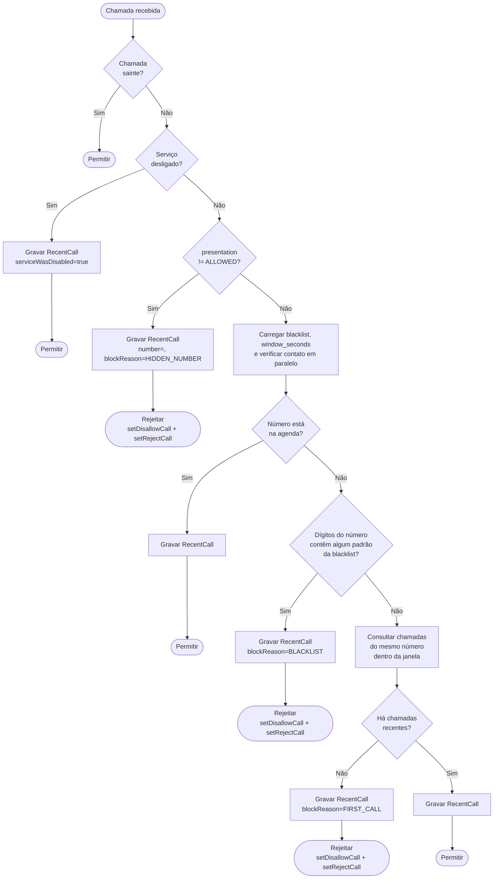
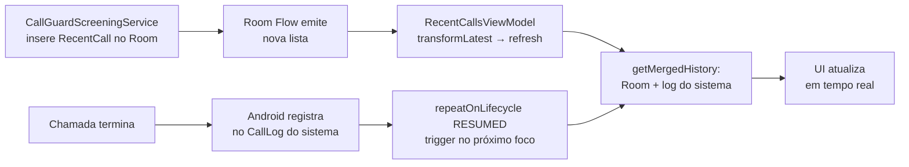
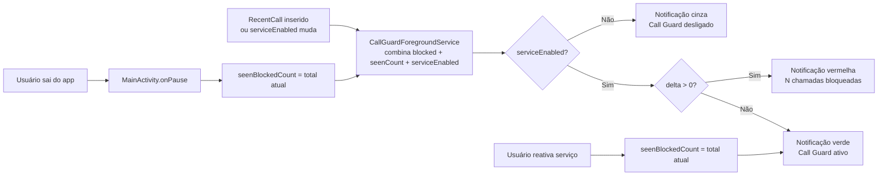

# Call Guard: Arquitetura

Aplicativo Android de triagem de chamadas. Bloqueia automaticamente chamadas de números desconhecidos e permite configurar uma lista negra baseada em sequências numéricas.

**Regra principal:** chamadas de números na agenda são sempre permitidas. Para os demais, a chamada é permitida somente se o número já tiver ligado anteriormente dentro da janela de tempo configurada. Chamadas de números na lista negra são sempre bloqueadas.

---

## Histórico de versões

### v0.2.3 (2026-05-18)
- **fix:** ao detectar mudança de `versionCode` (via chave `last_version_code` no DataStore), reseta `autostart_prompt_shown` e `autostart_configured` para `false`, re-disparando o onboarding de início automático como na primeira instalação; cobre fabricantes (MIUI em especial) que revogam a permissão de início automático durante atualizações do app; na primeira instalação (`last_version_code == 0`), nenhum reset ocorre

### v0.2.2 (2026-05-18)
- **feat:** "Número desconhecido" exibido no histórico para qualquer número não apresentável (vazio, "-1" ou "unknown"), independente de quem processou a chamada
- **feat:** campo `handledByApp` em `CallHistoryItem`; o histórico exibe "· Call Guard" quando a chamada passou pelo app e "· Sistema" quando veio apenas do log do sistema
- **feat:** layout de duas linhas no histórico: status e atribuição na primeira linha, timestamp na segunda
- **feat:** ícone "?" ao lado de "Lista Negra" (no `TopAppBar`) e "Janela de tempo" (no `ListItem`), via `TooltipBox` com `TooltipAnchorPosition.Above`; o texto de ajuda existente é exibido ao toque

### v0.2.1 (2026-05-17)
- **feat:** toggle ON/OFF na tela de Configurações ("Habilitar Call Guard"); quando desligado, o serviço permanece ativo mas responde com permitir a todas as chamadas; chamadas recebidas com serviço desligado são gravadas no Room com `serviceWasDisabled = true`; notificação persistente exibida em cinza via `CHANNEL_DISABLED`
- **feat:** ao reativar o serviço, `seenBlockedCount` é atualizado para o total atual de chamadas bloqueadas, garantindo que a notificação volte ao estado verde independente do estado anterior ao desligamento
- **feat:** `BootReceiver` redefine `service_enabled = true` via `goAsync()` a cada reinicialização do dispositivo
- **feat:** histórico exibe "Permitida (serviço desligado)" para chamadas recebidas com o serviço desligado; número oculto recebido nessa condição exibe "Número oculto"

### v0.2.0 (2026-05-17)
- **feat:** detecção de números ocultos via `getHandlePresentation()`; chamadas com `presentation != PRESENTATION_ALLOWED` (cobre `PRESENTATION_RESTRICTED`, `PRESENTATION_UNKNOWN` e `PRESENTATION_PAYPHONE`) são bloqueadas imediatamente como `HIDDEN_NUMBER`, antes de qualquer outra verificação
- **fix:** fallback de `handle` nulo removido de `onScreenCall`; `PRESENTATION_ALLOWED` garante handle não nulo, tornando o check redundante

### v0.1.9 (2026-05-11)
- **feat:** `PhoneStateReceiver`, receiver estático que detecta `EXTRA_STATE_IDLE` (fim de chamada) e restaura o FGS; cobre chamadas que contornam o `CallScreeningService` (ex: bypass MIUI para contatos). Requer apenas `READ_BASIC_PHONE_STATE` (normal, auto-concedida); suporte a Android ≤12 via `READ_PHONE_STATE` removido
- **feat:** `WatchdogWorker`, worker periódico via `WorkManager` que chama `startFromBackground()` a cada 15 minutos; agendado em `CallGuardApp.onCreate()` com política `KEEP`
- **fix (#3):** campo `allowed: Boolean` removido de `RecentCall`; schema migrado para versão 4 via `@AutoMigration` + `@DeleteColumn`; referências em `CallGuardScreeningService` atualizadas
- **fix (#4):** `ContactsRepository`: `@Volatile var cache` substituído por `AtomicReference<Map<String, String>?>`
- **fix (#5):** `CallLogRepository.readSystemCallLog()`: entradas com número nulo ignoradas (antes usavam `""`); uso de `continue` no cursor
- **fix (#9):** lógica de correspondência de contatos unificada via libphonenumber; eliminada duplicação entre `isContact()` e `getContactName()`
- **fix (#15):** logs `Log.w` e `Log.e` desprotegidos em `CallGuardScreeningService` envolvidos em `if (BuildConfig.DEBUG)`
- **fix (#16):** `SettingsViewModel.downloadUpdate()` valida que a URL começa com `https://github.com/acdcmaia/call-guard/` antes de iniciar o download
- **fix (#18):** loop de polling do download envolto em `withTimeoutOrNull(10 * 60_000L)`; timeout define estado `DOWNLOAD_ERROR`
- **fix (#19):** cursor de polling do `DownloadManager` usa `?: continue` para null e `cursor.use {}` para fechamento automático
- **fix (#21):** `WindowSecondsDialog`: `onConfirm(secs!!)` substituído por `onConfirm(secs ?: return@TextButton)`
- **fix (#22):** `delay(500)` no loop de polling do download aumentado para `delay(1_000)`
- **fix (#25):** `ContactsRepository` usa `libphonenumber-android` para normalizar números para E.164; cache indexado por E.164 (ou dígitos como fallback); lookup por chave direta em vez de comparação de sufixo
- **feat:** detecção de permissões revogadas pelo auto-reset do Android (API 30+); `onStartCommand` verifica `READ_CONTACTS` e `READ_CALL_LOG`; se qualquer uma estiver revogada, exibe notificação de alerta no canal `callguard_warning` ("Permissões revogadas. Toque para restaurar.") com `PendingIntent` para `MainActivity`; notificação cancelada automaticamente quando as permissões são restauradas

### v0.1.8 (2026-05-06)
- **feat:** `onStartCommand` verifica o role a cada reinício do serviço e exibe notificação de alerta no canal `callguard_warning` (`IMPORTANCE_HIGH`) com texto "Triagem inativa. Toque para reativar." se o `ROLE_CALL_SCREENING` não estiver presente
- **fix:** caminho do keystore corrigido
- **security:** credenciais do keystore migradas para `local.properties`

### v0.1.7 (2026-04-25)
- **fix (ultra economia MIUI):** `PowerSaveReceiver` agora escuta também `miui.intent.action.POWER_SAVE_MODE_CHANGED` (broadcast proprietário do MIUI) e `ACTION_DEVICE_IDLE_MODE_CHANGED` (saída do Doze); no Android 12+ usa `JobScheduler` expedited via `ServiceRestartJob` para contornar o bloqueio de `startForegroundService` em background
- **fix (ultra economia):** `CallGuardForegroundService` registra receiver dinâmico para `ACTION_SCREEN_ON` em `onCreate`; re-posta notificação quando a tela acende com processo congelado (notificação removida pelo SO sem matar o serviço)
- **fix (ultra economia):** `CallGuardScreeningService` chama `startFromBackground` ao final de cada chamada triada; usa a execução garantida pelo framework de telefonia como gatilho para restaurar ícone e notificação quando o FGS foi morto pelo ultra modo
- **fix:** `CallGuardForegroundService.onCreate` lê count real do DB/DataStore via `runBlocking` antes do primeiro `startForeground`, eliminando "pisca verde" transitório ao reiniciar o serviço após processo morto
- **fix:** `setSeenBlockedCount` movido de `MainActivity.onResume` para `onPause`; o contador de chamadas bloqueadas não é zerado ao abrir o app, só ao sair; preserva o estado da notificação ao retornar do ultra modo e abrir o app
- **chore:** `build.gradle.kts` release usa `releaseConfig` (keystore `callguard.jks`) em vez do keystore debug, eliminando conflito de assinatura ao instalar via Android Studio sobre APK publicado no GitHub

### v0.1.6 (2026-04-24)
- **fix:** ícone de status e notificação desapareciam ao entrar no modo de economia de bateria e não voltavam ao sair; `PowerSaveReceiver` ouve `ACTION_POWER_SAVE_MODE_CHANGED` e chama `startForegroundService` ao sair do modo de economia; `onStartCommand` agora re-chama `startForeground` com o último contador cacheado em `lastBlockedCount`; `MainActivity.onResume()` também chama `start()` como fallback para quando o usuário abre o app manualmente

### v0.1.5 (2026-04-23)
- **feat:** início automático após reinicialização do dispositivo (`BootReceiver` + `RECEIVE_BOOT_COMPLETED`)
- **feat:** tela de onboarding para configuração de início automático em fabricantes com restrição (Xiaomi, Samsung, Huawei, Honor, OPPO, Realme, Vivo, OnePlus, Asus, Meizu, Nokia); atalho direto para as configurações do fabricante via `AutoStartHelper`
- **feat:** nova opção "Início automático do aplicativo" na tela de Configurações, destacada em vermelho quando ainda não configurado
- **fix:** chamadas efetuadas apareciam como "Liberada" no histórico; `onScreenCall` dispara para saídas (`DIRECTION_OUTGOING`) no Android 10+; adicionado retorno antecipado para esse caso
- **fix:** chamadas bloqueadas pelo SO (`BLOCKED_TYPE`) apareciam como "Liberada" em vez de "Bloqueada"
- **fix (MIUI):** falso `BOOT_COMPLETED` disparado pelo processo de backup do MIUI durante instalação causava crash, bloqueado por verificação de uptime (`SystemClock.elapsedRealtime() > 5 min`)
- **fix (MIUI):** `ForegroundServiceDidNotStartInTimeException` causava crash silencioso na primeira abertura, interceptada via `UncaughtExceptionHandler` em `CallGuardApp`

### v0.1.4 (2026-04-21)
- **feat:** auto-atualização: ao detectar nova versão, o app baixa o APK diretamente do GitHub release via `DownloadManager` e abre o instalador do sistema automaticamente
- **feat:** barra de progresso de download na tela de Configurações durante o download
- **feat:** verificação de permissão "Instalar apps desconhecidos": se não concedida, redireciona para as configurações do sistema antes de iniciar o download
- **chore:** permissão `REQUEST_INSTALL_PACKAGES` adicionada ao manifesto
- **chore:** `FileProvider` configurado (`com.acdcmaia.callguard.fileprovider`) para expor o APK baixado via URI `content://`

### v0.1.3 (2026-04-21)
- **feat:** checagem automática de atualização disponível na tela de Configurações: ao ganhar foco, o app consulta a GitHub API e exibe "Atualização disponível!" (vermelho) ou "Sem atualizações a fazer"
- **feat:** item "Verificar atualizações" na lista de Configurações: abre o browser no releases do GitHub
- **feat:** item "Sobre" movido para lista de Configurações (era ícone "i" oculto no `TopAppBar`)
- **fix:** comparação de versões feita componente a componente (corrige casos como `0.1.10` vs `0.2.0`)
- **fix:** permissão `INTERNET` adicionada ao manifesto

### v0.1.2 (2026-04-21)
- **feat:** onboarding unificado: ao abrir o app pela primeira vez, o usuário configura em sequência: role de triagem → permissões (Contatos, Histórico, Notificações) → isenção de bateria
- **fix:** notificação oculta na tela de bloqueio (`VISIBILITY_SECRET` nos dois canais)
- **fix:** itens de qualidade e segurança: `database` privado, `collectAsStateWithLifecycle()` em todas as telas, `@OptIn` centralizado, validação de intent em `onNewIntent()`, `try/catch IOException` no DataStore, constante `PRUNE_WINDOW_MS`

### v0.1.1 (2026-04-20)
- **fix:** badge do ícone do app não zerava ao abrir pelo launcher; dois canais de notificação (`callguard_blocked` com `setShowBadge(true)` e `callguard_idle` com `setShowBadge(false)`) resolvem o problema em MIUI e no Samsung Launcher
- **fix:** APK release gerado pelo assistente de assinatura do Studio era renomeado com sufixo `.debug` quando o task `assembleDebug` processava a pasta `app/release/`; o filtro `it.name.contains(variant)` corrige a renomeação cruzada

### v0.1.0 (2026-04-19)
- Versão inicial pública

---

## Estrutura do projeto

Projeto Android de módulo único (`app`), compilado com SDK 36, mínimo SDK 29 (Android 10).

```
call-guard/
├── app/src/main/
│   ├── AndroidManifest.xml
│   └── java/com/acdcmaia/callguard/
│       ├── CallGuardApp.kt          # Application: inicializa repositórios
│       ├── MainActivity.kt          # Entrada + gestão do role de triagem
│       ├── AutoStartHelper.kt       # Atalhos para configurações de início automático por fabricante
│       ├── data/
│       │   ├── db/                  # Room: entidades, DAOs, base de dados
│       │   ├── CallRepository.kt    # Blacklist + chamadas recentes
│       │   ├── CallLogRepository.kt # Histórico mesclado (Room + sistema), filtra efetuadas, resolve nomes
│       │   ├── SettingsRepository.kt# Preferências (DataStore): janela de tempo + contador de bloqueadas vistas
│       │   ├── ContactsRepository.kt# Verificação e resolução de nomes da agenda
│       │   └── CallHistoryItem.kt   # Modelo de exibição do histórico
│       ├── service/
│       │   ├── CallGuardScreeningService.kt  # Triagem de chamadas
│       │   ├── CallGuardForegroundService.kt # Notificação persistente dinâmica
│       │   ├── BootReceiver.kt               # Inicia o serviço após reinicialização do dispositivo
│       │   ├── MarkSeenReceiver.kt           # Receptor de broadcast para marcar notificação como vista
│       │   ├── PowerSaveReceiver.kt          # Reinicia o serviço ao sair dos modos de economia de bateria
│       │   ├── PhoneStateReceiver.kt         # Restaura o FGS ao fim de qualquer chamada (estado IDLE)
│       │   ├── WatchdogWorker.kt             # Worker periódico que reinicia o FGS a cada 15 minutos
│       │   └── ServiceRestartJob.kt          # JobService expedited para reinício do FGS no Android 12+
│       └── ui/
│           ├── Navigation.kt        # Bottom navigation (3 abas)
│           ├── calls/               # Histórico de chamadas
│           ├── blacklist/           # Lista negra
│           └── settings/            # Configurações
```

---

## Componentes principais

### `CallGuardApp`
Classe `Application`. Inicializa e expõe como singletons:
- `AppDatabase` (Room)
- `CallRepository`
- `CallLogRepository`
- `SettingsRepository`
- `ContactsRepository`

Também instala um `UncaughtExceptionHandler` global via `installFgsRecoveryHandler()`. Se a exceção for `ForegroundServiceDidNotStartInTimeException` (crash silencioso causado pelo MIUI, ver § Decisões de arquitetura), o app agenda um reinício automático e encerra o processo. Outras exceções são delegadas ao handler original.

Em `onCreate`, agenda o `WatchdogWorker` via `WorkManager.enqueueUniquePeriodicWork()` com política `KEEP`; se já estiver agendado, o timer existente é preservado.

A extensão `Context.callGuardApp` permite que qualquer componente acesse o `CallGuardApp` sem cast explícito.

### `MainActivity`
- Verifica se o app possui o `ROLE_CALL_SCREENING` do Android
- Se não tiver, exibe tela pedindo permissão via `RoleManager`
- Se tiver, inicia o `CallGuardForegroundService`
- Em `onResume()`, chama `CallGuardForegroundService.start()` para restaurar a notificação caso ela tenha sido suprimida pelo modo de economia de bateria
- Em `onPause()`, zera o contador da notificação (lê o total atual de bloqueadas e salva em `seenBlockedCount`); o contador só é zerado quando o usuário sai do app, preservando o estado correto da notificação enquanto o app está em primeiro plano

### `CallGuardScreeningService`
Implementa `CallScreeningService` do Android. É vinculado pelo framework telecom a cada chamada recebida.

- Retorna imediatamente com permitir para chamadas saintes (`DIRECTION_OUTGOING`), sem gravar no Room
- Verifica `serviceEnabled` (DataStore) logo em seguida; se desligado, grava `RecentCall` com `serviceWasDisabled = true` (sem `blockReason`) e responde com permitir; o número capturado é `schemeSpecificPart` se `PRESENTATION_ALLOWED`, ou string vazia para números ocultos
- Verifica `getHandlePresentation()` antes de qualquer outra lógica de triagem; se o valor for diferente de `PRESENTATION_ALLOWED`, grava `RecentCall` com `number = ""` e `blockReason = HIDDEN_NUMBER` e rejeita imediatamente; cobre números ocultos (`PRESENTATION_RESTRICTED`), desconhecidos (`PRESENTATION_UNKNOWN`) e orelhões (`PRESENTATION_PAYPHONE`)
- Executa a lógica de triagem em `Dispatchers.IO` com `coroutineScope { async }` para carregar blacklist, configurações e verificação de contato em paralelo
- Se o número estiver na agenda, permite imediatamente (espelhando o comportamento das OEMs)
- Sempre chama `respondToCall()`, inclusive em caso de exceção (fallback: permitir)
- Usa `setDisallowCall(true)` + `setRejectCall(true)` para bloquear; o chamador recebe sinal de ocupado imediatamente
- Ao final de cada chamada triada (bloqueada ou permitida), chama `CallGuardForegroundService.startFromBackground()`; usa a execução garantida pelo framework de telefonia como gatilho de recuperação quando o FGS foi morto pelo ultra modo de bateria

### `ContactsRepository`
Consulta `ContactsContract.CommonDataKinds.Phone` para verificar se um número pertence à agenda e obter o nome do contato. O cache é um `AtomicReference<Map<String, String>?>` (E.164 ou dígitos → nome de exibição), invalidado via `ContentObserver` quando os contatos do dispositivo mudam. Os números são normalizados para E.164 via `libphonenumber-android` durante o carregamento do cache (`loadCache`) e durante o lookup (`isContact`, `getContactName`); para números que não normalizam, usa dígitos como chave de fallback. O lookup é feito por acesso direto ao mapa, sem comparação de sufixo. O `ContentObserver` não é desregistrado intencionalmente; `ContactsRepository` é singleton de processo em `CallGuardApp`.

O `ContentObserver` e as queries ao `ContentResolver` são guardados por verificação de `READ_CONTACTS`; se a permissão não foi concedida ainda, o `init` não registra o observer e `loadCache()` retorna mapa vazio. Após o usuário conceder a permissão, `RecentCallsScreen` chama `registerPermission()` para ativar o observer retroativamente.

Métodos públicos:
- `isContact(number)`: verifica se o número está na agenda
- `getContactName(number)`: retorna o nome do contato, ou `null` se não encontrado
- `registerPermission()`: registra o `ContentObserver` após permissão concedida em runtime

### `CallGuardForegroundService`
Serviço de notificação persistente (`foregroundServiceType="specialUse"`, subtipo `callScreening`). Mantém o processo do app vivo para garantir que o `CallGuardScreeningService` seja vinculado pelo telecom sem ser morto pelo sistema.

Observa em tempo real a combinação de três flows via `observeNotificationState()`:
1. `CallRepository.countBlockedFlow()`: total acumulado de chamadas bloqueadas no Room (últimas 100)
2. `SettingsRepository.seenBlockedCount`: total visto na última vez que o app foi aberto
3. `SettingsRepository.serviceEnabled`: estado do toggle ON/OFF

O estado da notificação é determinado na seguinte ordem de prioridade:
- **Serviço desligado:** fundo cinza, ícone de escudo simples, texto "Call Guard desligado" (`CHANNEL_DISABLED`)
- **Delta = 0:** fundo verde, ícone de escudo simples, texto "Call Guard ativo" (`CHANNEL_IDLE`)
- **Delta > 0:** fundo vermelho, ícone de escudo com !, texto "N chamada(s) bloqueada(s)" (`CHANNEL_BLOCKED`)

Ao detectar transição de desligado para ativo, `seenBlockedCount` é atualizado para o total atual de chamadas bloqueadas, zerando o delta; a notificação volta ao verde independente do estado anterior ao desligamento.

O `PendingIntent` da notificação aponta para `MainActivity` via `PendingIntent.getActivity()`. Três canais distintos controlam o badge do ícone do app:
- `callguard_blocked` (`setShowBadge(true)`): usado quando há bloqueios não vistos
- `callguard_idle` (`setShowBadge(false)`): usado no estado normal; suprime o badge mesmo com notificação ongoing
- `callguard_disabled` (`setShowBadge(false)`): usado quando o serviço está desligado

Em `onCreate`, lê o count correto do DB e do DataStore via `runBlocking(Dispatchers.IO)` antes do primeiro `startForeground`, garantindo que a notificação já apareça com o estado correto (vermelho com contagem) ao reiniciar após processo morto, sem "pisca verde" transitório.

Registra dinamicamente um `BroadcastReceiver` em `onCreate` (desregistrado em `onDestroy`):
- `screenOnReceiver`: escuta `ACTION_SCREEN_ON`; re-posta a notificação com `lastBlockedCount` e `lastServiceEnabled` quando a tela acende após o ultra modo de bateria ter congelado o processo (sem matar o serviço)

Quarto canal `callguard_warning` (`IMPORTANCE_HIGH`, `VISIBILITY_PUBLIC`) usado para três tipos de alerta, todos disparados em `onStartCommand`:
- **Triagem inativa** (`NOTIFICATION_WARNING_ID = 2`): quando `ROLE_CALL_SCREENING` não está presente
- **Permissões revogadas** (`NOTIFICATION_PERMISSION_ID = 3`): quando `READ_CONTACTS` ou `READ_CALL_LOG` foram revogadas pelo auto-reset do Android (API 30+)
- **Restrição de bateria ativa** (`NOTIFICATION_BATTERY_ID = 4`): quando a isenção de `REQUEST_IGNORE_BATTERY_OPTIMIZATIONS` foi removida manualmente pelo usuário

Todas aparecem como heads-up, fazem som e são canceladas automaticamente quando a condição é resolvida. Tocar em qualquer uma abre `MainActivity`, cujo `onResume` detecta e aciona o passo de onboarding correspondente.

Mantém `lastBlockedCount` e `lastServiceEnabled` como campos de instância para cachear o último estado emitido. Em `onStartCommand`, re-chama `startForeground` com esses valores cacheados, restaurando a notificação caso ela tenha sido removida pelo modo de economia de bateria sem reiniciar o serviço.

Ao iniciar (via `onStartCommand`), executa uma única vez a poda de chamadas com mais de 30 dias e ajusta o `seenBlockedCount` para que não ultrapasse o novo total pós-poda.

### `BootReceiver`
`BroadcastReceiver` que escuta `ACTION_BOOT_COMPLETED` e inicia o `CallGuardForegroundService` após reinicialização do dispositivo. Registrado com `android:exported="false"`.

Contém uma guarda de uptime: se `SystemClock.elapsedRealtime() > 5 min` ao receber o broadcast, o evento é ignorado; isso bloqueia o falso `BOOT_COMPLETED` que o processo de backup do MIUI dispara durante instalação/restauração.

Usa `goAsync()` para executar em coroutine: antes de iniciar o FGS, chama `settingsRepository.setServiceEnabled(true)` para garantir que o serviço sempre inicie habilitado após um reboot, independente do estado anterior ao desligamento do dispositivo.

### `PowerSaveReceiver`
`BroadcastReceiver` registrado com `android:exported="false"` que escuta três broadcasts de mudança de modo de energia:

| Broadcast | Cobre |
|---|---|
| `ACTION_POWER_SAVE_MODE_CHANGED` | Saída da economia de bateria padrão do Android |
| `ACTION_DEVICE_IDLE_MODE_CHANGED` | Saída do modo Doze |
| `miui.intent.action.POWER_SAVE_MODE_CHANGED` | Saída do ultra modo de bateria do MIUI (broadcast proprietário; extra `miui.intent.extra.POWER_SAVE_MODE = 0` indica desativado) |

No Android 12+ (`Build.VERSION_CODES.S`), não chama `startForegroundService` diretamente (pode ser bloqueado silenciosamente em contexto de receiver); em vez disso, agenda um `ServiceRestartJob` via `JobScheduler.schedule()` com `setExpedited(true)`. No Android 10/11, a chamada direta continua funcionando.

### `WatchdogWorker`
`Worker` (classe base do `WorkManager` para tarefas em background) periódico agendado pelo `CallGuardApp` a cada 15 minutos (intervalo mínimo permitido pelo `WorkManager`). Em `doWork()`, chama `CallGuardForegroundService.startFromBackground()` para garantir que o FGS esteja vivo. Se o FGS já estiver ativo, o resultado é apenas um `onStartCommand()` adicional que re-posta a notificação, operação idempotente e inofensiva.

O `WorkManager` inicializa automaticamente via `WorkManagerInitializer` (provedor de conteúdo interno da biblioteca, registrado automaticamente no manifesto sem necessidade de entrada manual). O agendamento usa `ExistingPeriodicWorkPolicy.KEEP` (política que preserva o trabalho já agendado, evitando que o timer seja reiniciado a cada restart do processo).

### `PhoneStateReceiver`
`BroadcastReceiver` estático que escuta `android.intent.action.PHONE_STATE`. Quando o estado da chamada transita para `EXTRA_STATE_IDLE` (chamada encerrada, atendida ou não), chama `startFromBackground()` para restaurar o `CallGuardForegroundService`. Cobre chamadas que não passam pelo `CallGuardScreeningService`, como o bypass automático do MIUI para contatos salvos na agenda.

Usa o mesmo padrão do `PowerSaveReceiver`: no Android 12+ agenda `ServiceRestartJob` via `JobScheduler.setExpedited(true)`; em versões anteriores chama `startForegroundService` diretamente.

Requer apenas `READ_BASIC_PHONE_STATE` (normal, concedida automaticamente na instalação). O suporte a Android ≤12 via `READ_PHONE_STATE` foi removido; nesses dispositivos o receiver não recebe o broadcast, e o `WatchdogWorker` cobre o cenário.

### `ServiceRestartJob`
`JobService` executado pelo `JobScheduler` no Android 12+ a pedido do `PowerSaveReceiver`. Chama `CallGuardForegroundService.startFromBackground()` em `onStartJob` e finaliza imediatamente (`jobFinished`, sem reschedule). Registrado no manifesto com `android:permission="android.permission.BIND_JOB_SERVICE"`.

### `AutoStartHelper`
Objeto singleton que mapeia fabricantes para as intents de configuração de início automático do respectivo gerenciador de sistema (Xiaomi, Samsung, Huawei, Honor, OPPO, Realme, Vivo, OnePlus, Asus, Meizu, Nokia). Métodos:
- `canOpen(context)`: retorna `true` se o dispositivo tem uma intent de início automático resolvível
- `open(context)`: abre a tela de configuração do fabricante; retorna `false` se não disponível ou se a activity lançar exceção

### `MarkSeenReceiver`
`BroadcastReceiver` com `android:exported="false"`. Mantido no manifesto para uso futuro; a lógica de reset do contador está em `MainActivity.onPause()`.

---

## Camada de dados

### Room: `callguard.db`

| Tabela | Entidade | Descrição |
|---|---|---|
| `blacklist_patterns` | `BlacklistPattern` | Sequências de dígitos a bloquear |
| `recent_calls` | `RecentCall` | Registro de cada chamada processada pelo app |

**`BlacklistPattern`**
```
id (PK, autoincrement)
pattern: String   (sequência de dígitos, ex: "91234")
label: String     (descrição opcional)
```

**`RecentCall`**
```
id (PK, autoincrement)
number: String
timestamp: Long
blockReason: BlockReason?     (BLACKLIST | FIRST_CALL | HIDDEN_NUMBER | null se permitida)
matchedPattern: String?       (padrão da blacklist que correspondeu, ou null)
serviceWasDisabled: Boolean   (true se a chamada foi recebida com o serviço desligado; default 0)
```

### DataStore: `settings`

| Chave | Tipo | Default | Descrição |
|---|---|---|---|
| `window_seconds` | Int | 120 | Janela de tempo em segundos |
| `seen_blocked_count` | Long | -1 | Total de bloqueadas na última vez que o app foi aberto; -1 (nunca aberto) é tratado como 0 no cálculo do delta |
| `autostart_prompt_shown` | Boolean | false | Se o onboarding de início automático já foi exibido ao usuário |
| `autostart_configured` | Boolean | false | Se o usuário confirmou que configurou o início automático no gerenciador do fabricante |
| `service_enabled` | Boolean | true | Estado do toggle ON/OFF de triagem; resetado para `true` a cada reinicialização do dispositivo |
| `last_version_code` | Int | 0 | `versionCode` da última execução; usado para detectar atualização do app e re-disparar o onboarding de início automático |

### `CallLogRepository`
Agrega duas fontes para o histórico:
1. **Log do sistema** (`CallLog.Calls`): chamadas registradas pelo Android, excluindo efetuadas (`OUTGOING_TYPE`) diretamente no `selection` do `ContentResolver.query()`; `LIMIT` aplicado via contador no cursor (não no sortOrder, pois MIUI rejeita SQL não padrão nesse parâmetro)
2. **Room** (`recent_calls`): chamadas processadas pelo app

Para cada entrada, resolve o nome do contato via `ContactsRepository.getContactName()`. Entradas do Room sem correspondência no log do sistema (chamadas bloqueadas ainda não registradas pelo Android) aparecem imediatamente como `appOnly = true`, garantindo atualização em tempo real. Entradas do log do sistema com correspondência no Room recebem `handledByApp = true`; entradas sem correspondência (apenas no log do sistema, sem processamento pelo app) recebem `handledByApp = false`. Entradas Room-only recebem `handledByApp = true`.

### `CallHistoryItem`
Modelo de exibição do histórico. Campos relevantes:

| Campo | Tipo | Descrição |
|---|---|---|
| `number` | String | Número do chamador |
| `contactName` | String? | Nome do contato na agenda, ou null |
| `timestamp` | Long | Momento da chamada |
| `callType` | Int | Tipo conforme `CallLog.Calls` (-1 para `appOnly`) |
| `blockReason` | BlockReason? | Motivo do bloqueio, ou null se permitida |
| `appOnly` | Boolean | True para bloqueadas ainda não no log do sistema |
| `serviceWasDisabled` | Boolean | True se a chamada foi recebida com o serviço desligado |
| `handledByApp` | Boolean | True quando a chamada foi processada pelo app; false quando veio apenas do log do sistema |

---

## Fluxo de triagem de chamada

A verificação de contatos precede a verificação da lista negra porque em MIUI e Samsung o SO permite chamadas de contatos antes de invocar o `onScreenCall()`. Implementar a checagem de lista negra antes da agenda não teria efeito prático nesses OEMs, pois contatos passariam de qualquer forma. O fluxo abaixo aplica-se apenas às chamadas que chegam ao `onScreenCall()`.



---

## Fluxo de atualização do histórico



---

## Fluxo da notificação dinâmica



---

## Lógica de correspondência da lista negra

A correspondência **não usa regex**. É uma busca de substring sobre os dígitos do número:

```
número chamador : "+5521912345678"
dígitos extraídos: "5521912345678"
padrão na blacklist: "91234"
resultado: BLOQUEADO  ✓  ("5521912345678".contains("91234"))
```

Wildcards não são suportados. O campo da lista negra aceita apenas dígitos.

---

## Navegação

Bottom navigation com 3 abas:

| Rota | Tela | Descrição |
|---|---|---|
| `calls` | `RecentCallsScreen` | Histórico de chamadas liberadas e bloqueadas (efetuadas não exibidas); nome do contato exibido quando disponível; bloqueadas em vermelho |
| `blacklist` | `BlacklistScreen` | Gerenciar sequências bloqueadas; suporta adicionar, editar e remover |
| `settings` | `SettingsScreen` | Habilitar Call Guard (toggle ON/OFF; primeiro item); Janela de tempo; Início automático do aplicativo (destacado em vermelho quando `autostart_configured = false` e o fabricante suporta); Sobre (dialog com versão/build/desenvolvedor); Verificar atualizações (checagem automática via GitHub API; ao detectar nova versão, baixa e instala o APK sem sair do app) |

---

## Permissões e role

**Concedidas automaticamente na instalação (permissões normais):**

| Permissão | Motivo |
|---|---|
| `INTERNET` | Consultar a GitHub API e baixar APKs de atualização |
| `FOREGROUND_SERVICE` / `FOREGROUND_SERVICE_SPECIAL_USE` | Manter o serviço persistente ativo (tipo `specialUse`, subtipo `callScreening`) |
| `RECEIVE_BOOT_COMPLETED` | Receber o broadcast de reinicialização para iniciar o serviço automaticamente |
| `READ_BASIC_PHONE_STATE` | Detectar fim de chamada via `PhoneStateReceiver`; concedida automaticamente na instalação (Android 13+) |

**Solicitadas em runtime (exigem ação do usuário):**

| Permissão | Como é solicitada | Motivo |
|---|---|---|
| `ROLE_CALL_SCREENING` | Dialog de role do sistema (onboarding) | Obrigatório para o `CallScreeningService` ser vinculado pelo telecom |
| `READ_CONTACTS` | Dialog do sistema (onboarding) | Verificar se o número chamador está na agenda e resolver nomes |
| `READ_CALL_LOG` | Dialog do sistema (onboarding) | Ler o log de chamadas do sistema para o histórico |
| `POST_NOTIFICATIONS` | Dialog do sistema (onboarding, Android 13+) | Notificação do `CallGuardForegroundService` |
| `REQUEST_IGNORE_BATTERY_OPTIMIZATIONS` | Dialog do sistema (onboarding) | Evitar que o SO mate o serviço em background |
| `REQUEST_INSTALL_PACKAGES` | Redireciona para Settings (ao baixar atualização) | Instalar o APK baixado pelo mecanismo de auto-atualização |

O role é solicitado via `RoleManager.createRequestRoleIntent`. É exclusivo; só um app pode deter o role por vez. Cada reinstalação revoga o role e gera novo UID, apagando a base de dados Room.

---

## Decisões de arquitetura

**`coroutineScope { async }` no serviço de triagem**
Blacklist, configurações e verificação de contato são carregadas em paralelo dentro de `coroutineScope`. Usar `CoroutineScope(Dispatchers.IO).async` criaria scopes não gerenciados; `coroutineScope` garante concorrência estruturada e propagação de exceções.

**Verificação de contatos no próprio app**
Mesmo em OEMs que já fazem bypass automático (MIUI, Samsung), a verificação de contatos é feita pelo próprio app. Isso garante comportamento consistente em dispositivos onde o `onScreenCall` é invocado para contatos, e espelha a decisão que as OEMs tomariam.

**Fallback always-allow**
Qualquer exceção não tratada durante a triagem resulta em `respondToCall` com resposta padrão (permitir). O Android impõe um timeout; não chamar `respondToCall` também deixaria a chamada passar, mas geraria ANR no serviço.

**`setDisallowCall + setRejectCall`**
Bloquear apenas com `setDisallowCall` silencia a chamada do lado do destinatário mas o chamador continua a ouvir toque. Adicionar `setRejectCall` envia sinal de ocupado imediatamente, encerrando a chamada no lado do chamador também.

**Histórico com dupla fonte**
O log do sistema só registra chamadas após o fim da ligação. Para mostrar chamadas bloqueadas imediatamente, o `CallLogRepository` inclui registros do Room sem correspondência no log do sistema (`appOnly = true`). Quando o log do sistema eventualmente registra a entrada, ela substitui a entrada `appOnly` no próximo refresh.

**Contador de notificação por delta de contagem**
O estado da notificação é determinado pela diferença entre o total acumulado de chamadas bloqueadas no Room (limitado às 100 mais recentes, consistente com o histórico visível) e o valor `seenBlockedCount` salvo no DataStore. O valor `-1` (nunca inicializado) é tratado como `0` no cálculo (`maxOf(0L, total - maxOf(0L, seen))`), garantindo que a primeira chamada bloqueada já apareça na notificação.

**Reset do contador em `MainActivity.onPause()`**
O `seenBlockedCount` é atualizado para o total atual de chamadas bloqueadas quando `MainActivity` sai do primeiro plano (usuário pressiona home, back ou muda de app). Isso garante que a notificação exiba o estado correto ao retornar do ultra modo ou ao abrir o app, o ícone vermelho com a contagem correta permanece visível enquanto o usuário está no app e é zerado somente ao sair. A notificação usa `PendingIntent.getActivity()` apontando para `MainActivity`; tentar abrir a activity a partir de um `BroadcastReceiver` em background é bloqueado pelo Android 10+ e causava falha silenciosa.

**`foregroundServiceType="specialUse"`**
O tipo `dataSync` tem janela de execução máxima de 6 horas no Android 14+ (API 34). O tipo `specialUse` com subtipo declarado `callScreening` não tem essa limitação e reflete com precisão o propósito do serviço.

**`IMPORTANCE_DEFAULT` + `setSilent(true)` nos canais de notificação**
`IMPORTANCE_LOW` impede `setColorized(true)` em Samsung One UI e possivelmente outros OEMs. `IMPORTANCE_DEFAULT` garante a colorização, e `setSilent(true)` suprime o som/vibração que `DEFAULT` normalmente produziria.

**Dois canais para controle de badge**
Um único canal com `setShowBadge(false)` aplicaria a mesma regra a todos os estados da notificação. Para que o badge apareça apenas quando há bloqueios não vistos e suma ao abrir o app, são usados dois canais: `callguard_blocked` com `setShowBadge(true)` e `callguard_idle` com `setShowBadge(false)`. A notificação alterna de canal conforme o delta. `setNumber()` complementa o controle em launchers que o respeitam.

**`SharingStarted.WhileSubscribed(5_000)` no ViewModel**
O `StateFlow` de histórico cancela a coleta 5 segundos após a última UI sair do ciclo de vida ativo. Isso evita releituras do `CallLog` do sistema em background a cada inserção no Room.

**Tooltips com `PopupPositionProvider` customizado**
O Material3 `TooltipDefaults` não expõe controle de posição vertical. É usado um `PopupPositionProvider` customizado em dois contextos:
- **Lista Negra** ("Sequência de dígitos"): posicionado abaixo do campo (`anchorBounds.bottom`)
- **Configurações** (dialog "Janela de tempo"): posicionado acima do campo (`anchorBounds.top - popupContentSize.height`), exibido automaticamente ao focar o campo

Os ícones "?" ao lado dos títulos "Lista Negra" (no `TopAppBar`) e "Janela de tempo" (no `ListItem`) usam `TooltipDefaults.rememberTooltipPositionProvider(TooltipAnchorPosition.Above)`, o provider padrão do Material3 posicionado acima do ícone âncora.

**`SettingsScreen` baseada em dialog**
O campo de texto para janela de tempo foi substituído por um `ListItem` clicável que abre um `AlertDialog` com o campo e botões Cancelar/Salvar, idêntico ao padrão da Lista Negra. Elimina problemas de salvamento dependente de foco (o valor só é persistido ao confirmar o dialog).

**`UncaughtExceptionHandler` para crash MIUI de FGS**
O MIUI cria um `ServiceRecord` mesmo quando `startForegroundService()` é negado durante o processo de backup/restauração. O timer desse registro expira na próxima abertura do app, causando `ForegroundServiceDidNotStartInTimeException`, uma exceção não capturável no ponto de chamada porque ocorre no processo do Android. O `CallGuardApp` instala um `UncaughtExceptionHandler` global que intercepta especificamente esse tipo, agenda um reinício via `startActivity` e mata o processo. O resultado visível ao usuário é uma reinicialização automática do app em vez de um crash silencioso.

**`PhoneStateReceiver` para chamadas que contornam o screening**
Em OEMs como MIUI, chamadas de contatos da agenda contornam o `CallScreeningService`; `onScreenCall` nunca é invocado e, com isso, `startFromBackground()` nunca é chamado ao final dessas chamadas. O `PhoneStateReceiver` detecta `EXTRA_STATE_IDLE` (fim de chamada, atendida ou não) e chama `startFromBackground()` para garantir que o FGS seja restaurado também nesses casos. O disparo é idempotente: se o FGS já estiver ativo, `onStartCommand` apenas re-posta a notificação.

**Detecção de condições críticas em background**
Quatro condições são verificadas em `onStartCommand` a cada reinício do serviço, exibindo notificação de alerta no canal `callguard_warning` quando ausentes: `ROLE_CALL_SCREENING`, `READ_CONTACTS`, `READ_CALL_LOG` e isenção de `REQUEST_IGNORE_BATTERY_OPTIMIZATIONS`. Cada alerta é cancelado automaticamente quando a condição é restaurada. Tocar em qualquer alerta abre `MainActivity`, cujo `onResume` detecta a condição faltante e exibe o passo de onboarding correspondente. A detecção em tempo real via receiver dinâmico (`ACTION_ROLES_CHANGED`) foi descartada para o role; o receiver morre junto com o processo quando o app é suspenso, que é exatamente o cenário em que o role é perdido.

**Guarda de uptime no `BootReceiver`**
O MIUI dispara `BOOT_COMPLETED` para o processo de backup durante instalação/restauração, muito antes de um boot real ter ocorrido. A guarda `SystemClock.elapsedRealtime() > 5 min` descarta esse broadcast espúrio: em um boot real, o evento chega nos primeiros minutos de uptime; o broadcast falso do MIUI chega quando o sistema já está há horas em execução.

---

## Comportamento em OEMs: MIUI e Samsung

Em dispositivos Xiaomi (MIUI) e Samsung, o framework telecom **ignora o `CallScreeningService` para números salvos nos contatos**, aprovando-os automaticamente sem invocar `onScreenCall`.

**Confirmação:** testado adicionando e removendo o mesmo número da agenda. Com o número na agenda, `onScreenCall` nunca é invocado (logcat do `system_server` mostra `[Allow, contact exists]`, zero logs `CallGuard`). Com o número removido da agenda, o serviço de triagem é invocado normalmente e o bloqueio funciona.

**Comportamento do app:** o `CallGuardScreeningService` também verifica a agenda via `ContactsRepository` como primeira etapa da triagem. Em OEMs onde o bypass não existe, o app garante o mesmo comportamento: contatos são sempre permitidos. Em OEMs onde o bypass já existe (MIUI, Samsung), a verificação interna é redundante mas inofensiva.

**Ícone na barra de status:** confirmado no MIUI que o `setSmallIcon()` é respeitado; o ícone muda de forma conforme o estado (escudo simples = ativo, escudo com ! = bloqueadas pendentes).

**Implicação prática:** chamadas de contatos salvos na agenda nunca são bloqueadas em MIUI e Samsung, independente da lista negra. O SO permite a chamada antes de o `onScreenCall()` ser invocado. Por esse motivo, a checagem de lista negra não foi implementada com prioridade sobre a checagem de contatos. Mesmo que fosse, o bloqueio não funcionaria nesses OEMs. Não existe API pública para interceptar esse comportamento.

**Restrição de bateria no MIUI:** pode impedir o binding do serviço para números desconhecidos; definir o app como "Sem restrições" em Configurações → Aplicativos → Call Guard → Bateria.

**Falso `BOOT_COMPLETED` no MIUI:** o processo de backup do MIUI dispara `ACTION_BOOT_COMPLETED` durante instalação/restauração, causando crash se o `BootReceiver` tentar iniciar o `CallGuardForegroundService` nesse momento. O `BootReceiver` bloqueia esse caso verificando se o uptime é superior a 5 minutos antes de agir.

**Family Link: perda de triagem durante restrição de uso:** quando o dispositivo supervisionado entra em restrição de uso (limite de tempo atingido ou horário de uso configurado), o Family Link suspende os apps via `DevicePolicyManager.setPackagesSuspended()`. O Android revoga automaticamente o `ROLE_CALL_SCREENING` de apps suspensos. Durante o período de restrição, chamadas são recebidas sem triagem. Não existe API pública que impeça um Device Admin de suspender um app de terceiro; esta é uma limitação arquitetural do Android sem solução do lado do app.

---


## Melhorias pendentes

Rastreadas como issues no repositório: [github.com/acdcmaia/call-guard/issues](https://github.com/acdcmaia/call-guard/issues)
