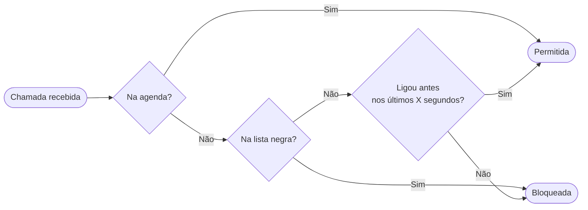

# Call Guard

Call Guard é um aplicativo Android de triagem de chamadas. O princípio é simples: robôs de telemarketing e spam trocam de número a cada tentativa, enquanto pessoas reais ligam do mesmo número. Com base nisso, o app bloqueia qualquer número desconhecido na primeira chamada, e só permite a ligação se o mesmo número chamador se repetir dentro de uma janela de tempo configurável, sinalizando que é um chamador legítimo. Números salvos na agenda do dispositivo são sempre permitidos. Além disso, o app permite criar uma lista negra por sequência numérica: qualquer chamada cujo número contenha a sequência configurada é rejeitada imediatamente.

## Como funciona



- **Contatos da agenda:** números salvos na agenda são sempre permitidos
- **Lista negra:** qualquer chamada cujo número contenha a sequência configurada é bloqueada imediatamente
- **Primeira chamada:** números desconhecidos são bloqueados na primeira tentativa
- **Repetição:** se o mesmo número ligar novamente dentro da janela de tempo configurada, a chamada é permitida

## Requisitos

- Android 10 (API 29) ou superior
- Permissão de triagem de chamadas (`ROLE_CALL_SCREENING`)
- Permissão de leitura de contatos (`READ_CONTACTS`) — solicitada na primeira execução

## Instalação

1. Vá em [Releases](../../releases)
2. Faça o download do arquivo `.apk` mais recente
3. Instale no dispositivo (pode ser necessário permitir instalação de fontes desconhecidas)

## Utilização

### Janela de tempo
Em **Configurações**, defina quantos segundos o app aguarda por uma repetição de chamada. Default: 120 segundos.

### Lista negra
Em **Lista Negra**, adicione sequências de dígitos. Qualquer chamada cujo número contenha essa sequência será rejeitada.

> Ex.: a sequência `91234` bloqueia chamadas de `021XXXXXXXXX`

### Histórico
Em **Chamadas**, constam os registros de todas as chamadas processadas. Chamadas bloqueadas aparecem em vermelho.

## Compilação do projeto

**Pré-requisitos:**
- Android Studio Hedgehog ou superior
- JDK 11

**Passos:**
1. Clone o repositório
   ```bash
   git clone https://github.com/acdcmaia/call-guard.git
   ```
2. Abra o projeto no Android Studio
3. Faça `Build → Build APK(s)`

## Limitações conhecidas

**MIUI (Xiaomi) e Samsung:** o sistema ignora o serviço de triagem para números salvos nos contatos, aprovando-os automaticamente antes mesmo de consultar o app. O comportamento final é o mesmo — contatos sempre passam — mas chamadas de contatos não aparecem no histórico do app nesses dispositivos.

**Restrição de bateria no MIUI:** pode impedir o funcionamento do serviço. Definir o app como "Sem restrições" em Configurações → Aplicativos → Call Guard → Bateria.

## Licença

Uso pessoal.
