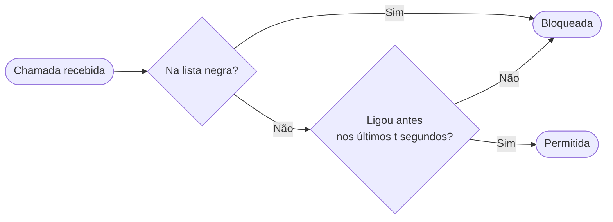

# Call Guard

Call Guard é um aplicativo Android de triagem de chamadas. O princípio é simples: robôs de telemarketing e spam trocam de número a cada tentativa, enquanto pessoas reais ligam do mesmo número. Com base nisso, o app bloqueia qualquer número desconhecido na primeira chamada, e só permite a ligação se o mesmo número chamador se repetir dentro de uma janela de tempo configurável, sinalizando que é um chamador legítimo. Além disso, o app permite criar uma lista negra por sequência numérica: qualquer chamada cujo número contenha a sequência configurada é rejeitada imediatamente, independentemente do histórico. 

## Como funciona



- **Lista negra:** qualquer chamada cujo número contenha a sequência configurada é bloqueada imediatamente
- **Primeira chamada:** números desconhecidos são bloqueados na primeira tentativa
- **Repetição:** se o mesmo número ligar novamente dentro da janela de tempo configurada, a chamada é permitida

## Requisitos

- Android 10 (API 29) ou superior
- Permissão de triagem de chamadas (`ROLE_CALL_SCREENING`)

## Instalação

1. Vai a [Releases](../../releases)
2. Faz download do ficheiro `.apk` mais recente
3. Instala no dispositivo (pode ser necessário permitir instalação de fontes desconhecidas em Definições → Segurança)

## Utilização

### Janela de tempo
Em **Configurações**, define quantos segundos o app aguarda por uma repetição de chamada. Default: 120 segundos.

### Lista negra
Em **Lista Negra**, adiciona sequências de dígitos a bloquear. Qualquer chamada cujo número contenha essa sequência será rejeitada.

> Ex.: a sequência `98181` bloqueia chamadas de `021XXXXXXXX`

### Histórico
Em **Chamadas**, vê o registo de todas as chamadas processadas. Chamadas bloqueadas aparecem a vermelho.

## Compilar o projeto

**Pré-requisitos:**
- Android Studio Hedgehog ou superior
- JDK 11

**Passos:**
1. Clona o repositório
   ```bash
   git clone https://github.com/acdcmaia/call-guard.git
   ```
2. Abre o projeto no Android Studio
3. Faz `Build → Build APK(s)`

## Limitações conhecidas

**MIUI (Xiaomi):** o sistema ignora o serviço de triagem para números guardados nos contactos, aprovando-os automaticamente. O app funciona corretamente apenas para números não guardados na agenda.

## Licença

Uso pessoal.
