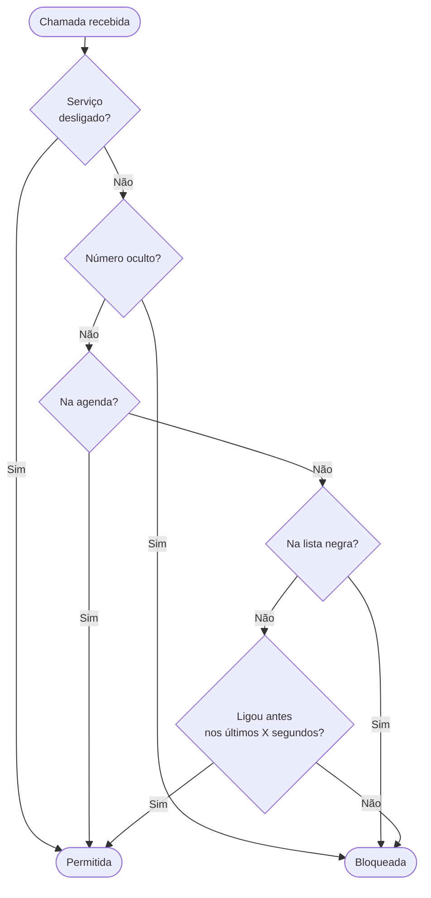

# Call Guard

Call Guard é um aplicativo Android de triagem de chamadas. A regra central é simples: chamadas de números desconhecidos só são atendidas se o mesmo número ligar mais de uma vez dentro de uma janela de tempo configurável. Robôs de telemarketing e spam trocam de número a cada tentativa; pessoas reais não. Além disso, chamadas com número oculto são sempre bloqueadas, números da agenda são sempre permitidos e o app aceita uma lista negra por sequência numérica para bloqueio imediato. A triagem pode ser desativada a qualquer momento por um toggle nas Configurações.

## Como funciona



- **Serviço desligado:** quando desabilitado em Configurações, todas as chamadas são permitidas sem triagem
- **Número oculto:** chamadas sem identificação de origem (número oculto, desconhecido ou orelhão) são sempre bloqueadas
- **Contatos da agenda:** números salvos na agenda são sempre permitidos
- **Lista negra:** qualquer chamada cujo número contenha a sequência configurada é bloqueada imediatamente
- **Primeira chamada:** números desconhecidos são bloqueados na primeira tentativa
- **Repetição:** se o mesmo número ligar novamente dentro da janela de tempo configurada, a chamada é permitida

## Requisitos

- Android 10 (API 29) ou superior
- As permissões abaixo são solicitadas no onboarding, na primeira execução:
  - Triagem de chamadas (`ROLE_CALL_SCREENING`)
  - Leitura de contatos (`READ_CONTACTS`)
  - Leitura do histórico de chamadas (`READ_CALL_LOG`)
  - Notificações (`POST_NOTIFICATIONS`): Android 13 ou superior
  - Isenção de otimização de bateria (`REQUEST_IGNORE_BATTERY_OPTIMIZATIONS`)
  - Instalação de aplicativos de fontes desconhecidas (permite update automático): concedida em **Configurações → Aplicativos → [app usado para abrir o APK] → Instalar apps desconhecidos**

## Instalação

1. Vá em [Releases](../../releases)
2. Faça o download do arquivo `.apk` mais recente
3. Abra o arquivo no dispositivo para iniciar a instalação
4. Após a instalação, abra o Call Guard e siga o onboarding para conceder as permissões necessárias

## Utilização

### Ligar/desligar a triagem
Em **Configurações**, o toggle **Habilitar Call Guard** (primeiro item) ativa ou desativa a triagem. Quando desligado, todas as chamadas são permitidas e a notificação fica cinza. Ao reativar, o app volta ao estado verde, sem histórico de chamadas pendentes. Após reiniciar o dispositivo, o serviço é sempre religado automaticamente.

### Janela de tempo
Em **Configurações**, defina quantos segundos o app aguarda por uma repetição de chamada. Default: 120 segundos.

### Lista negra
Em **Lista Negra**, adicione sequências de dígitos. Qualquer chamada cujo número contenha essa sequência será rejeitada.

> Ex.: a sequência `91234` bloqueia chamadas de `02191234...`

### Histórico
Em **Chamadas**, constam os registros de chamadas liberadas e bloqueadas (chamadas efetuadas não são exibidas). Para contatos salvos na agenda, o nome é exibido junto ao número. Chamadas bloqueadas pelo app aparecem em vermelho; chamadas perdidas ou rejeitadas manualmente aparecem em laranja. Cada registro indica quem determinou o resultado da chamada: "· Call Guard" quando a triagem do app foi o fator decisivo, ou "· Sistema" quando o resultado foi determinado pelo usuário ou pelo sistema (chamadas perdidas, rejeitadas manualmente ou registradas apenas no log do sistema). Números sem identificação de origem são exibidos como "Número desconhecido".

### Notificação persistente
O app mantém uma notificação ativa enquanto o serviço de triagem estiver em execução:

- **Fundo verde / ícone de escudo:** sem novos bloqueios desde a última abertura do app
- **Fundo vermelho / ícone de escudo com !:** indica quantas chamadas foram bloqueadas desde a última abertura do app
- **Fundo cinza / ícone de escudo:** serviço desligado manualmente em Configurações

Ao sair do app, o contador é zerado e a notificação volta ao estado verde.

A notificação é restaurada automaticamente quando uma chamada chega após o dispositivo sair do modo de economia de bateria.

Se o serviço de triagem for desativado pelo sistema (ex.: por um gerenciador de controle parental), uma notificação de alerta é exibida automaticamente. Toque nela para reativar a triagem.

### Início automático
O app inicia automaticamente após a reinicialização do dispositivo. Em fabricantes com restrição de início automático (Xiaomi, Samsung, Huawei e outros), uma tela de configuração é exibida na primeira execução com atalho direto para as configurações do fabricante.

Ao atualizar o app, a permissão de início automático pode ser revogada pelo fabricante. Nesse caso, a tela de configuração é exibida novamente automaticamente para que o usuário a restaure.

O status do início automático também pode ser verificado em **Configurações → Início automático do aplicativo**, destacado em vermelho enquanto não estiver configurado.

### Atualizações
Em **Configurações → Verificar atualizações**, o app consulta automaticamente a disponibilidade de uma nova versão. Ao detectar, baixa e instala o APK diretamente sem sair do app.

### Sobre
Em **Configurações → Sobre**, são exibidos a versão, a data de build e o desenvolvedor.

### Contribuição
Em **Configurações**, toque no campo **Gostou** ou no ícone "?" ao lado para exibir o dado de contribuição via Pix. O campo é recolhido automaticamente ao sair da aba.

## Compilação do projeto

**Pré-requisitos:**
- Android Studio Hedgehog ou superior
- JDK 11

**Passos:**
1. Clone o repositório
   ```bash
   git clone https://github.com/acdcmaia/call-guard.git
   ```
2. Abra o projeto no Android Studio
3. Faça `Build → Build APK(s)`

## Limitações conhecidas

**Impossibilidade de bloquear contatos em MIUI e Samsung:** nesses OEMs, o SO permite chamadas de contatos antes de invocar o serviço de triagem do app. Por esse motivo, a lista negra não foi implementada com prioridade sobre a agenda. Mesmo que fosse, o bloqueio não funcionaria nesses dispositivos.

**Restrição de bateria no MIUI:** pode impedir o funcionamento do serviço. Definir o app como "Sem restrições" em Configurações → Aplicativos → Call Guard → Bateria.

**Ultra economia de bateria (MIUI e outros):** o modo ultra mata o serviço de notificação. O ícone e as mensagens são restaurados automaticamente na próxima chamada recebida, sem necessidade de abrir o app.

**Início automático em MIUI, Samsung, Huawei e outros:** alguns fabricantes bloqueiam o início automático de aplicativos após reinicialização ou atualização. O app exibe a tela de configuração na primeira execução e após cada atualização do app, com atalho para as configurações do fabricante. Sem essa configuração, o serviço de triagem não inicia automaticamente após reiniciar o dispositivo.

**Início automático em Samsung com One UI recente:** a tela de configuração de início automático não aparece no app (nem no onboarding nem em Configurações) em dispositivos Samsung com versões mais recentes do One UI, pois o caminho interno da tela mudou entre versões do sistema. Samsung tende a ser menos restritivo com início automático do que o MIUI, tornando o impacto prático reduzido.

**Family Link: restrição de uso:** em dispositivos supervisionados pelo Google Family Link, quando o dispositivo entra em restrição de uso (limite de tempo atingido ou horário configurado), o sistema suspende o app e revoga a autorização de triagem de chamadas. Durante esse período, chamadas são recebidas sem triagem. Esta é uma limitação do Android sem solução do lado do app.

## Licença

Distribuído sob a licença [MIT](LICENSE).
